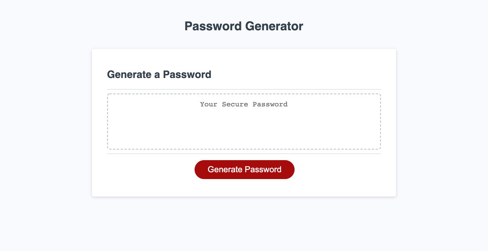

https://alexandra-hionis.github.io/secure-password-generator/
# Secure Password Generator
This secure password generator will provide a better level of security. It will output a truly unique and random password using HTML and CSS powered by JavaScript code. It has a clean and simple interface and is responsive to any screen size.

# Password Requirements
In order to produce a safe and unique password, certain criteria must be met. It has to have a length of 8-128 characters, at least one uppercase character, one lowercase character, one numeric character and one special character. 

